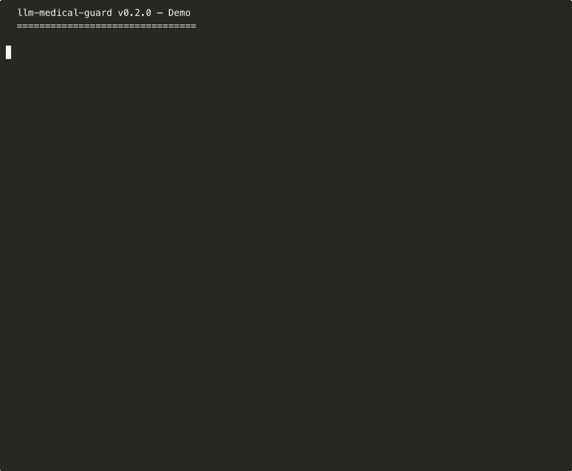

<p align="center">
  <a href="https://github.com/MOB-sys/llm-medical-guard/actions/workflows/ci.yml"></a>
  <a href="https://codecov.io/gh/MOB-sys/llm-medical-guard"></a>
  <a href="https://pypi.org/project/llm-medical-guard/"></a>
  
  <a href="LICENSE"></a>
  
</p>

# llm-medical-guard

> Safety guardrails for LLM-generated medical and health content.

**The first open-source library specifically designed to validate medical content from LLMs.**

Generic guardrail tools (NeMo Guardrails, Guardrails AI, LLM Guard) handle toxicity and PII but know nothing about medicine. `llm-medical-guard` catches dangerous medical claims, validates dosages, flags drug interactions, detects fear-mongering tone, enforces disclaimers, and suggests safe alternatives — in **5 languages**, with a CLI, pytest plugin, and streaming support.

<p align="center">
  
  <br>
  <em>CLI catching dangerous dosage + cure claim + missing disclaimer in real-time</em>
</p>

## Why?

LLMs confidently generate medical misinformation. A model might say *"Take 50,000 IU of Vitamin D daily to cure depression"* — that's a dangerous dosage with an unsubstantiated cure claim. This library catches both issues in **64µs** (15,000+ checks/sec), with zero API calls.

## Quick Start

```bash
pip install llm-medical-guard
```

### Python API

```python
from llm_medical_guard import MedicalGuard

guard = MedicalGuard()

result = guard.check(
    "Take 50000 IU of vitamin D daily to cure your depression. "
    "This miracle supplement has no side effects!"
)

print(result.passed)    # False
print(result.severity)  # Severity.DANGER
print(result.summary)
# 5/8 checks failed:
#   - [DANGER] banned_expressions: 'cure', 'no side effects'
#   - [WARNING] claim_severity: 'cure your depression'
#   - [WARNING] disclaimer: Required medical disclaimer not found
#   - [DANGER] dosage: vitamin d: 50000IU exceeds max 4000IU/day
#   - [WARNING] source_attribution: No authoritative source cited
```

### CLI

```bash
# Check text directly
llm-medical-guard check "This miracle cure has no side effects!"

# Check from file
llm-medical-guard check -f article.txt --strict

# JSON output for CI/CD
llm-medical-guard check --json "Your content here"

# Verbose mode with safe alternative suggestions
llm-medical-guard check -v "Take this to cure cancer!"

# Run benchmark
llm-medical-guard bench
#   Per check:     64.0µs
#   Throughput:    15,632 checks/sec

# Generate verification badge
llm-medical-guard badge "Your content" -o badge.svg
```

### Safe Alternatives

Not just blocking — suggests compliant replacements:

```python
for check in result.failed_checks:
    if "suggestions" in check.details:
        for expr, suggestion in check.details["suggestions"].items():
            print(f"  '{expr}' → '{suggestion}'")

# 'cure' → 'may help manage symptoms'
# 'no side effects' → 'side effects are uncommon but possible'
# 'miracle cure' → 'evidence-based treatment option'
```

## 8 Safety Checks

| Check | What it catches | Severity |
|-------|----------------|----------|
| **Banned Expressions** | Cure claims, fear-mongering, anti-professional statements | DANGER |
| **Claim Severity** | Unsubstantiated treatment/prevention claims | WARNING |
| **Disclaimer** | Missing medical disclaimers | WARNING |
| **Source Attribution** | No authoritative source cited (FDA, NIH, etc.) | WARNING |
| **Dosage** | Vitamin/supplement doses exceeding safe limits | DANGER |
| **Drug Interaction** | Known dangerous drug-drug/drug-supplement combinations | DANGER |
| **Context Awareness** | Fear-mongering vs. educational tone analysis | WARNING |
| **Brand Mention** | Pharmaceutical brand names (promotional risk) | CAUTION |

## Drug Interaction Database

15 critical interactions included out-of-the-box, extensible via custom rules:

```python
guard = MedicalGuard()
result = guard.check("You can safely take warfarin and aspirin together.")
# FAIL: Known interaction detected: warfarin+aspirin
# "Increased risk of serious bleeding" (Source: FDA Drug Label)
```

**Covered interactions include:**
- Warfarin + NSAIDs (bleeding risk)
- SSRIs + MAOIs (serotonin syndrome)
- Statins + Grapefruit (rhabdomyolysis)
- Levothyroxine + Calcium/Iron (absorption)
- St. John's Wort + Birth Control/SSRIs/Warfarin
- Metformin + Alcohol (lactic acidosis)
- Antibiotics + Dairy/Calcium (reduced absorption)
- And 8 more...

> **Note:** The built-in database covers the most critical and well-documented interactions sourced from FDA and NIH. It is not exhaustive — production systems handling novel drug combinations should layer this library with domain-specific databases. The rule engine is fully extensible via YAML config and custom check classes.

## Context-Aware Tone Analysis

Distinguishes educational content from fear-mongering and promotional content:

```python
# Educational — PASS
guard.check("Studies show vitamin D deficiency may increase risk of certain conditions.")

# Fear-mongering — FAIL
guard.check("This deadly combination is a ticking time bomb! They're hiding the cure!")

# Promotional — FAIL
guard.check("Buy now! Limited time offer! Use discount code HEALTH50!")
```

## Streaming Support

Check LLM output in real-time as chunks arrive:

```python
from llm_medical_guard import StreamGuard

stream_guard = StreamGuard(locale="en")

for chunk in llm_stream:
    alert = stream_guard.feed(chunk.content)
    if alert:
        print(f"Warning: {alert.summary}")
        # Optionally stop the stream

final_result = stream_guard.finalize()
```

Or use the generator:

```python
from llm_medical_guard import check_stream

for chunk, alert in check_stream(llm_chunks):
    print(chunk, end="")
    if alert:
        print(f"\nContent flagged: {alert.summary}")
```

## 5 Languages

```python
# English
guard = MedicalGuard(locale="en")

# Korean (한국어)
guard = MedicalGuard(locale="ko")
guard.check("이 약을 먹으면 암 예방이 됩니다!")
# Catches: "암 예방" (cancer prevention claim)

# Japanese (日本語)
guard = MedicalGuard(locale="ja")
guard.check("この薬は万能薬です。完治します。")
# Catches: "万能薬" (cure-all), "完治" (complete cure)

# Chinese (中文)
guard = MedicalGuard(locale="zh")
guard.check("这是包治百病的神药！")
# Catches: "包治百病" (cures all diseases), "神药" (miracle drug)

# Spanish (Español)
guard = MedicalGuard(locale="es")
guard.check("Esta cura milagrosa es 100% seguro!")
# Catches: "cura milagrosa" (miracle cure), "100% seguro" (100% safe)
```

## pytest Plugin

Test your health content in CI/CD:

```python
# conftest.py
pytest_plugins = ["llm_medical_guard.pytest_plugin"]

# test_health_content.py
def test_article_is_safe(medical_guard):
    article = load_article("vitamin_d_guide.txt")
    result = medical_guard.check(article)
    assert result.passed, result.summary

@pytest.mark.medical_guard(locale="ko", strict=True)
def test_korean_content(medical_guard):
    result = medical_guard.check("한국어 건강 콘텐츠...")
    assert result.passed
```

```bash
pytest --medical-guard --medical-guard-locale=en --medical-guard-strict
```

## Verification Badge

Generate an SVG badge for your docs/website:

```python
from llm_medical_guard import MedicalGuard
from llm_medical_guard.badge import generate_badge

guard = MedicalGuard()
result = guard.check(your_content)
generate_badge(result, "medical-guard-badge.svg")
```

```bash
llm-medical-guard badge -f article.txt -o badge.svg
```

## Configuration

### YAML Config

```yaml
# guard_config.yaml
locale: en
strict: false
checks:
  banned_expressions: true
  claim_severity: true
  disclaimer: true
  source_attribution: false  # disable for chatbot use
  dosage: true
  drug_interaction: true
  context_awareness: true
  brand_mention: false
custom_banned_expressions:
  - "detox cleanse"
  - "alkaline water cure"
custom_safe_alternatives:
  "detox cleanse": "support your body's natural detoxification"
```

```python
guard = MedicalGuard(config="guard_config.yaml")
```

### Programmatic Config

```python
guard = MedicalGuard(
    config={
        "custom_banned_expressions": ["snake oil", "miracle juice"],
        "custom_brands": ["HealthMax", "VitaBoost"],
    },
    locale="en",
    strict=True,  # raises MedicalGuardError on failure
)
```

### Selective Checks

```python
guard = MedicalGuard(checks=["banned_expressions", "dosage", "drug_interaction"])
```

## Framework Integrations

### LangChain

```python
from langchain_openai import ChatOpenAI
from llm_medical_guard.integrations.langchain import MedicalGuardParser

llm = ChatOpenAI(model="gpt-4o")
parser = MedicalGuardParser(locale="en")
chain = llm | parser

# Raises OutputParserException if content is unsafe
result = chain.invoke("What supplements help with sleep?")
```

### OpenAI SDK

```python
from llm_medical_guard.integrations.openai_wrapper import guarded_chat_completion

response, guard_result = guarded_chat_completion(
    model="gpt-4o",
    messages=[{"role": "user", "content": "Tell me about vitamin D dosage"}],
)

if not guard_result.passed:
    print("Content flagged:", guard_result.summary)
```

## Performance

```
Benchmarking llm-medical-guard (en)
  10,000 iterations × 5 samples = 50,000 total checks

  Per check:     64µs
  Throughput:    15,600+ checks/sec
  Memory:        ~5MB RSS
  Dependencies:  pyyaml only
```

Zero LLM API calls. Pure regex/rule-based. Deterministic results. Runs anywhere Python runs.

> **Design choice:** Rule-based detection is intentional. It gives you deterministic, auditable results at near-zero cost. For semantic-level validation (e.g., detecting subtly misleading claims), pair this library with an LLM-based reviewer — `llm-medical-guard` handles the fast, cheap first pass.

## Dosage Database

Built-in safe dosage limits for 10 common supplements:

| Supplement | Max Daily | Warning Threshold | Unit |
|-----------|----------|-------------------|------|
| Vitamin D | 4,000 | 10,000 | IU |
| Vitamin C | 2,000 | 5,000 | mg |
| Iron | 45 | 100 | mg |
| Calcium | 2,500 | 4,000 | mg |
| Zinc | 40 | 100 | mg |
| Omega-3 | 3,000 | 5,000 | mg |
| Magnesium | 400 | 800 | mg |
| Melatonin | 5 | 20 | mg |
| Vitamin A | 3,000 | 10,000 | mcg |
| Vitamin B6 | 100 | 200 | mg |

## Extending

### Custom Check

```python
from llm_medical_guard.checks import BaseCheck, CheckRegistry
from llm_medical_guard.result import CheckResult, CheckStatus, Severity

@CheckRegistry.register
class MyCustomCheck(BaseCheck):
    name = "my_check"
    description = "My custom medical content check"

    def run(self, text, config):
        if "unapproved" in text.lower():
            return CheckResult(
                check_name=self.name,
                status=CheckStatus.FAIL,
                severity=Severity.WARNING,
                message="Unapproved content detected",
            )
        return CheckResult(
            check_name=self.name,
            status=CheckStatus.PASS,
            severity=Severity.INFO,
            message="OK",
        )
```

### Custom Locale

Create a YAML file following the format in `src/llm_medical_guard/i18n/en.yaml`:

```python
guard = MedicalGuard(locale="de")  # will look for i18n/de.yaml
```

## Why Not Use General Guardrails?

| Feature | llm-medical-guard | NeMo Guardrails | Guardrails AI | LLM Guard |
|---------|:-----------------:|:---------------:|:-------------:|:---------:|
| Medical claim detection | Yes | No | No | No |
| Drug interaction checking | Yes | No | No | No |
| Dosage validation | Yes | No | No | No |
| Safe alternatives | Yes | No | No | No |
| Context-aware tone analysis | Yes | No | No | No |
| Medical disclaimer enforcement | Yes | No | No | No |
| Source attribution check | Yes | No | No | No |
| Multi-language medical rules | 5 | No | Partial | No |
| Streaming support | Yes | Yes | No | No |
| pytest plugin | Yes | No | Yes | No |
| CLI tool | Yes | No | Yes | Yes |
| Zero API cost | Yes | No | Partial | Yes |
| Performance | 64µs/check | ~100ms | ~50ms | ~10ms |

## Roadmap

**v0.3 — Data Expansion**
- [ ] Expanded drug interaction database (100+ interactions)
- [ ] Expanded dosage limits (30+ supplements/vitamins)
- [ ] German (de), French (fr), Portuguese (pt) locales

**v0.4 — Developer Tooling**
- [ ] Pre-commit hook (`llm-medical-guard` as a pre-commit check)
- [ ] VS Code extension (inline warnings)
- [ ] Anthropic SDK integration

**v1.0 — Enterprise**
- [ ] ICD-10 code detection
- [ ] FHIR resource validation
- [ ] EU AI Act compliance report generation
- [ ] Semantic-level validation (optional LLM-backed deep check)

## Contributing

Contributions welcome! See [CONTRIBUTING.md](CONTRIBUTING.md) for guidelines.

Priority areas:
- New locale files (de, fr, pt, ar, hi)
- Additional drug interaction data
- More dosage limits
- Better regex patterns to reduce false positives
- Integration with more LLM frameworks (Anthropic SDK, LlamaIndex)

## License

[MIT](LICENSE) — Use freely in commercial and open-source projects.

## Disclaimer

This library is a development tool for content safety screening. It does not provide medical advice and is not a substitute for professional medical review. Always have medical content reviewed by qualified healthcare professionals before publication.

---

Built with domain expertise from [Pillright](https://pillright.com) — a drug interaction checker serving 500K+ users.
